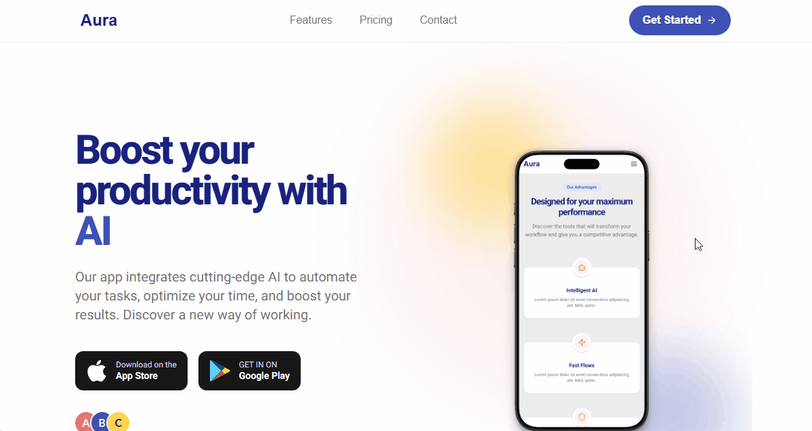

# Aura - Landing Page Demo 🚀



> Demo de una landing page moderna para "Aura", una startup tecnológica ficticia. El proyecto se enfoca en un diseño limpio, animaciones sutiles y una experiencia de usuario fluida implementada con Next.js y Tailwind CSS.

**Ver el proyecto en vivo:** [**https://aura-land-dave.vercel.app/**](https://aura-land-dave.vercel.app/)

---

## ✨ Características Principales

* **📱 Diseño Totalmente Responsivo:** Perfecta visualización en dispositivos móviles, tablets y escritorio.
* **⚡ Rendimiento Rápido:** Optimizada para velocidad gracias a la generación estática (SSG) de Next.js.
* **🎨 Estilos Modernos:** Interfaz de usuario limpia y atractiva implementada con las utilidades de Tailwind CSS.
* **🎬 Animaciones Sutiles:** Transiciones suaves y efectos de *scroll* para una experiencia de usuario dinámica y agradable.
* **SEO Optimizado:** Estructura semántica de HTML y metatags para un mejor posicionamiento.

---

## 🛠️ Stack Tecnológico


---

## 🚀 Instalación y Uso Local

Para clonar y correr este proyecto en tu máquina local, sigue estos pasos:

1.  **Clona el repositorio:**
    ```bash
    git clone [https://github.com/TechDaveDev/aura-land-dave.git](https://github.com/TechDaveDev/aura-land-dave.git)
    cd aura-land-dave
    ```

2.  **Instala las dependancias:**
    ```bash
    npm install
    ```

3.  **Inicia el servidor de desarrollo:**
    ```bash
    npm run dev
    ```

Abre [http://localhost:3000](http://localhost:3000) en tu navegador para ver la aplicación.